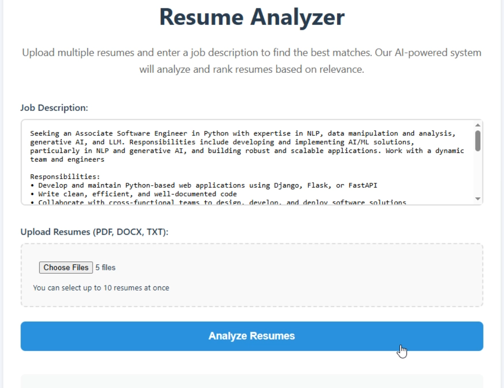
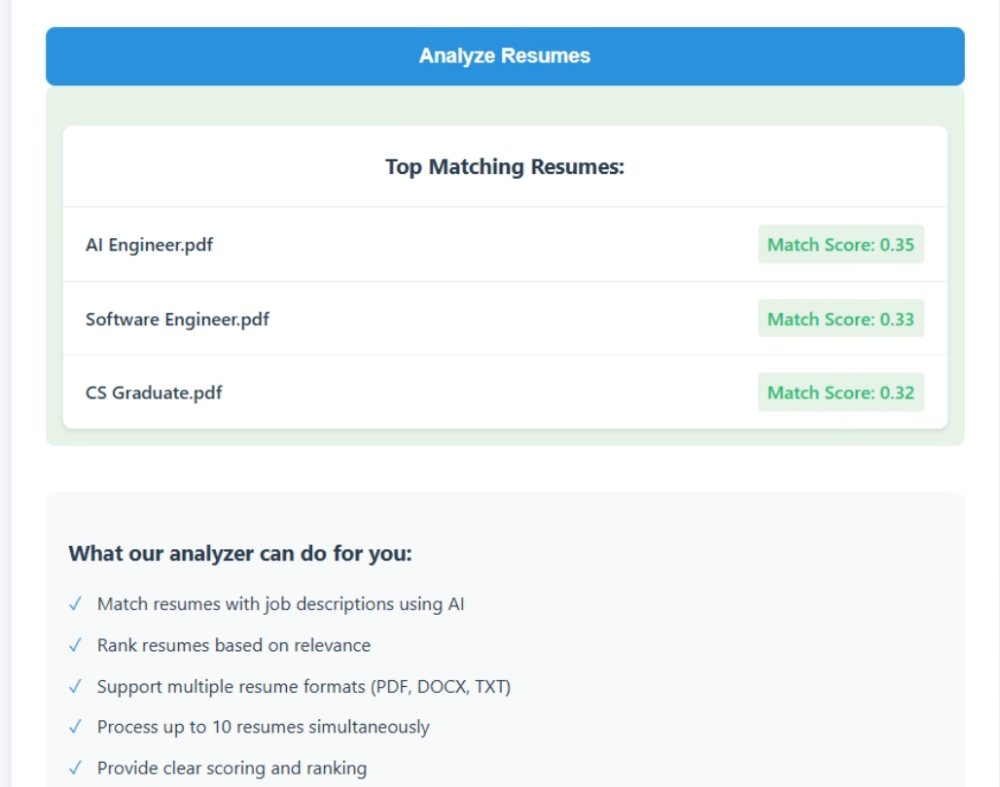

# Resume Analyzer

**Resume Analyzer** is a prototype web application that allows users to upload multiple resumes and compare them against a job description using vectorization and cosine similarity. The project is built using Python, Flask, and scikit-learn. It can also be enhanced using machine learning models for better efficiency and accuracy — work on this is in progress.

---

## Features

- Supports multiple resume formats: `.pdf`, `.docx`, `.txt`
- Uses TF-IDF vectorization and cosine similarity for scoring
- Ranks resumes based on relevance to the provided job description
- Allows users to upload and store resumes in a custom local path
- HTML/CSS templates can be customized as per your needs
- Can be deployed on the web using services like PythonAnywhere

---

## APP Interface





---

## How It Works

1. Users input a job description and upload up to 10 resumes.
2. The application extracts text from all resumes:
   - PDF: extracted using PyPDF2
   - DOCX: extracted using docx2txt
   - TXT: extracted via standard file read
3. Text data is vectorized using `TfidfVectorizer` from scikit-learn.
4. Cosine similarity is calculated between the job description and each resume.
5. The top 3 matching resumes are displayed along with their similarity scores.

---

## Running the App Locally

### Requirements

- Python 3.7 or higher
- Required Python packages (Check Requirements.txt)

### Installation

```bash
git clone https://github.com/ankitsharma-tech/resume-analyzer.git
cd resume-analyzer
pip install -r requirements.txt
```

### Launch the Application

```bash
python main.py
```

Resume files will be stored in the `uploads/` directory. You can change this path in the `main.py` file as needed.

---

## Deployment

This app can be deployed to web platforms such as:

- PythonAnywhere
- Render
- Railway
- Heroku (with appropriate setup like a `Procfile`)

---

## Collaboration and Development

Work is ongoing to enhance the application using machine learning for smarter resume-job matching. Planned features include:

- Deep learning-based similarity scoring
- Better handling of resume formatting and structure
- Filter options for specific qualifications, skills, or keywords
- User accounts and dashboard

Contributions are welcome.

---

## Tech Stack

- **Frontend**: HTML, CSS (with customization options)
- **Backend**: Python Flask
- **Text Processing**: TF-IDF, Cosine Similarity
- **File Parsing**: PyPDF2, docx2txt

---

## Notes

This is a prototype and may not handle every edge case. It serves as a proof-of-concept for resume screening and ranking based on textual similarity. For production use, improvements in model robustness and user interface are recommended.

---

## License

[Apache-2.0 License](LICENSE)
